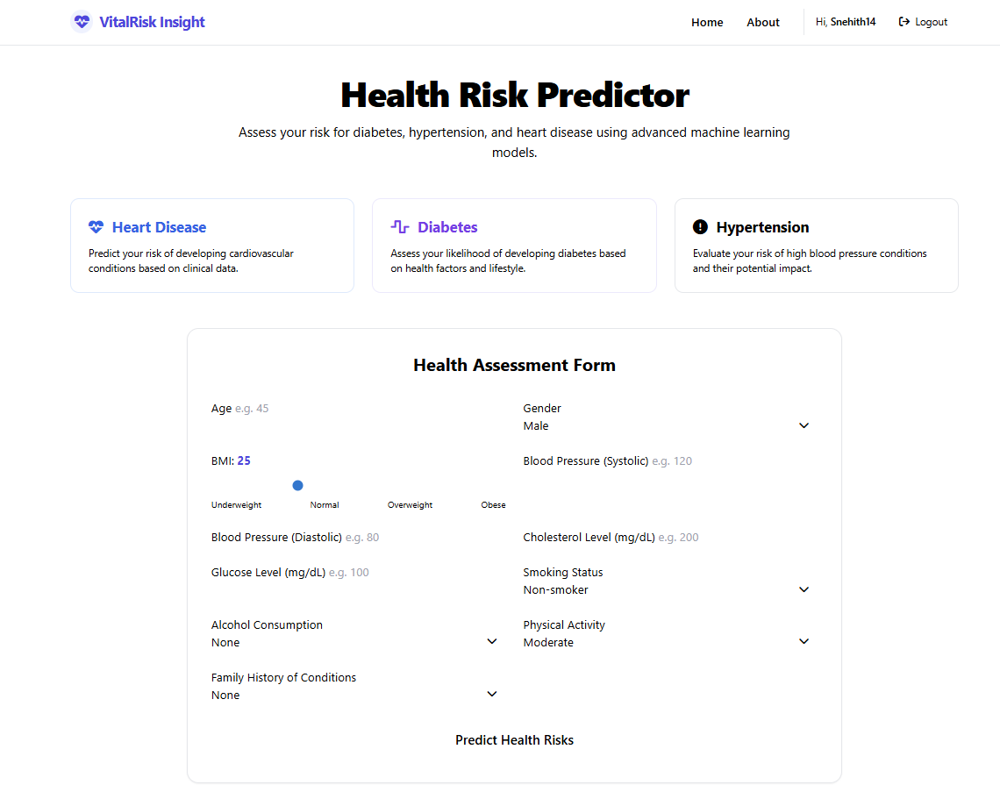
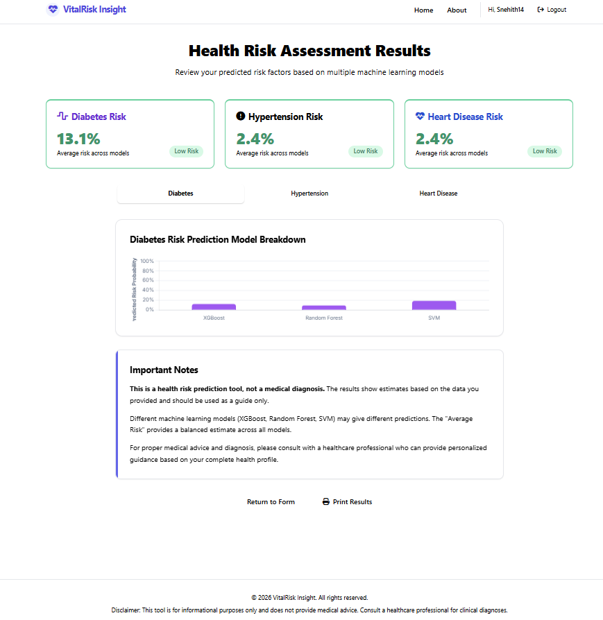
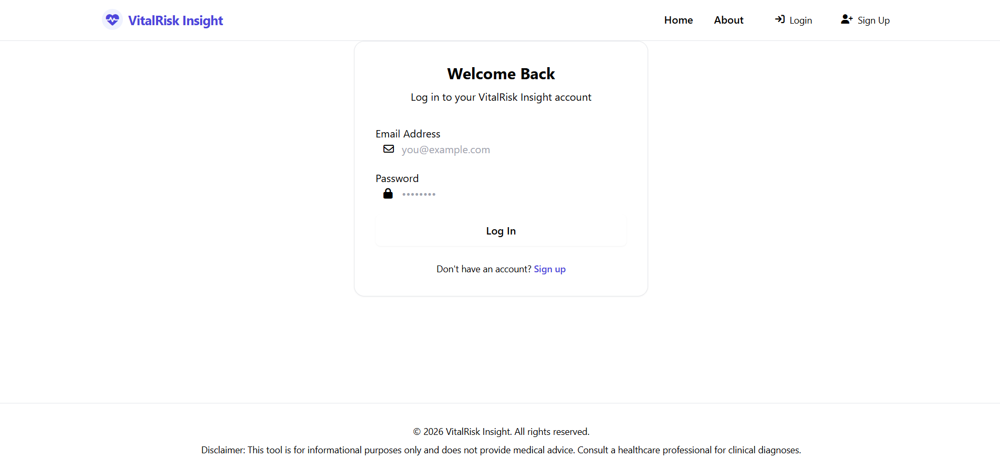
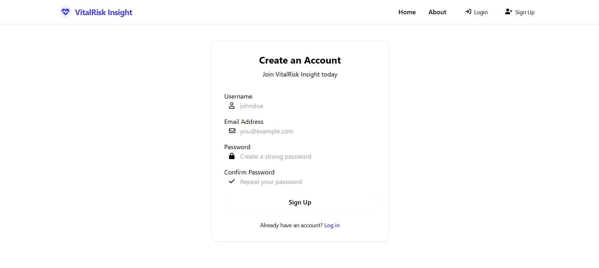
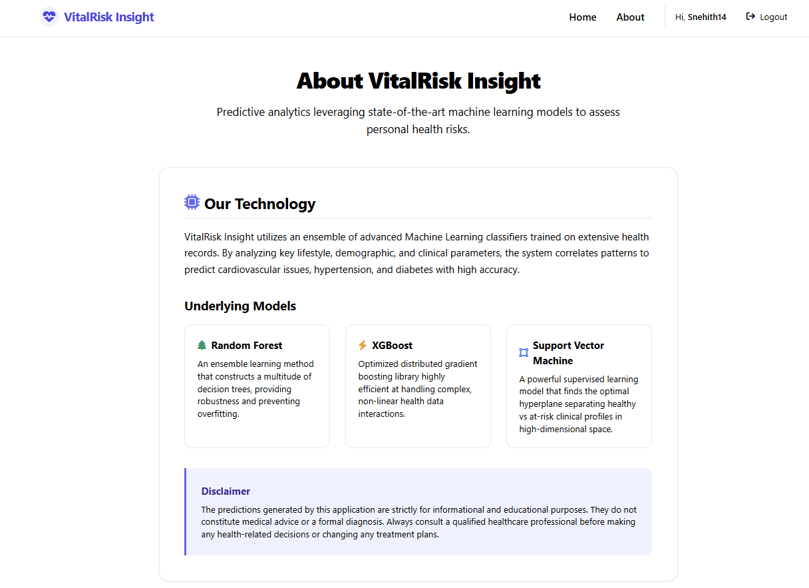

# VitalRisk Insight - Health Risk Predictor



### 🚀 [Live Demo: health-risk-predictor-zeta.vercel.app](https://health-risk-predictor-zeta.vercel.app/)

A comprehensive, full-stack predictive web application that leverages advanced Machine Learning algorithms (Random Forest, Gradient Boosting, Support Vector Machine) to evaluate a user's risk for **Diabetes**, **Hypertension**, and **Heart Disease** based on clinical and lifestyle factors.

## 🚀 Features

- **Multi-Disease Prediction**: Evaluates health risks utilizing 9 separate ML models.
- **Modern User Interface**: A beautifully responsive frontend built with Jinja2 templates and custom CSS (Tailwind-inspired).
- **Interactive Results Dashboard**: Dynamic Chart.js visualizations separating risk probability down to the individual algorithm.
- **Secure Authentication**: Robust user sign-up and login mechanism powered by Flask-Login and Werkzeug hashing.
- **Synthetic Data Generation**: Included script to generate realistic health data for initial model training out of the box.

## 📸 Screenshots

### The Health Assessment Form


### Results & Risk Breakdown


### Authentication



### About the Models


## 🛠️ Technology Stack

- **Backend**: Python, Flask, Flask-SQLAlchemy, Flask-Login
- **Machine Learning**: Scikit-Learn, Gradient Boosting, Pandas, Numpy
- **Frontend**: HTML5, CSS3, Jinja2, Chart.js

## 📦 Installation & Setup

1. **Clone the repository:**
   ```bash
   git clone https://github.com/snehithdasari/Health_Risk_Predictor.git
   cd Health_Risk_Predictor
   ```

2. **Install the dependencies:**
   ```bash
   pip install -r requirements.txt
   ```

3. **Train the ML Models:**
   (This generates the synthetic dataset and saves the `.pkl` files to the `ml_models` directory)
   ```bash
   python train_models.py
   ```

4. **Run the Application Server:**
   ```bash
   python app.py
   ```

5. **Access the App:**
   Open your browser and navigate to `http://127.0.0.1:5000`

## ⚠️ Disclaimer

This tool is strictly for informational and educational purposes. The predictions generated by the models do not constitute medical advice or a formal clinical diagnosis. Always consult a qualified healthcare professional before making health-related decisions.
